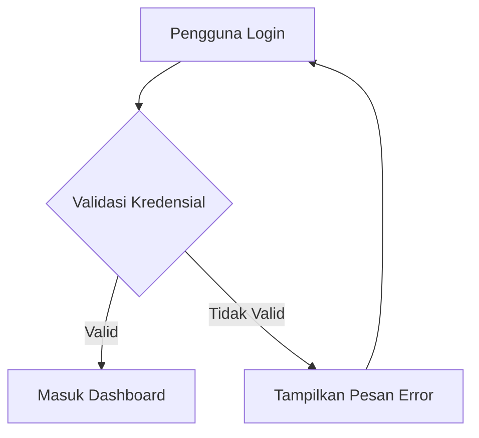
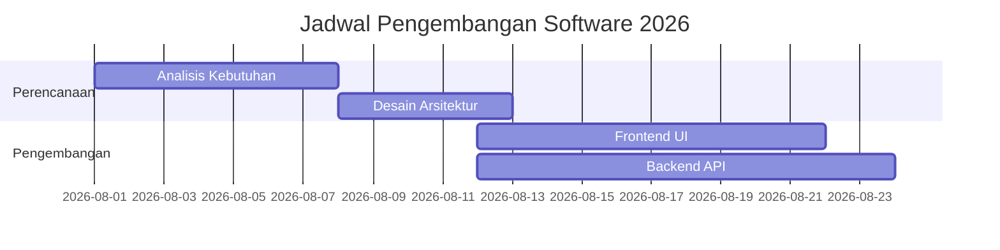

# Modul Pembelajaran Komprehensif: Panduan Lengkap Elemen & Fitur Markdown (.md)

> **Kode Dokumen:** MOD-MD-2026  
> **Target Audiens:** Pelajar, Pengembang Perangkat Lunak, Technical Writer, & Pengelola Proyek  
> **Persyaratan Awal:** Tidak ada (Cocok untuk pemula hingga tingkat lanjut)  
> **Lisensi Material:** Creative Commons Attribution 4.0 International (CC BY 4.0)

---

## Daftar Isi
1. [Pendahuluan & Konsep Dasar Markdown](#1-pendahuluan--konsep-dasar-markdown)
2. [Pemformatan Teks Dasar & Lanjutan](#2-pemformatan-teks-dasar--lanjutan)
3. [Struktur Judul & Hirarki Dokumen](#3-struktur-judul--hirarki-dokumen)
4. [Pengelolaan Daftar & Tugas (Lists & Checklists)](#4-pengelolaan-daftar--tugas-lists--checklists)
5. [Tautan, Gambar, & Integrasi Media](#5-tautan-gambar--integrasi-media)
6. [Kutipan, Callout, & Blok Catatan Khusus](#6-kutipan-callout--blok-catatan-khusus)
7. [Blok Kode & Highlighting Sintaks Pemrograman](#7-blok-kode--highlighting-sintaks-pemrograman)
8. [Tabel & Data Terstruktur](#8-tabel--data-terstruktur)
9. [Notasi Matematika & Formula Ilmiah (LaTeX)](#9-notasi-matematika--formula-ilmiah-latex)
10. [Elemen HTML Interaktif & Kustomisasi](#10-elemen-html-interaktif--kustomisasi)
11. [Visualisasi Diagram & Alur Kerja (Mermaid.js)](#11-visualisasi-diagram--alur-kerja-mermaidjs)
12. [Integrasi Khusus Platform (Trello, GitHub, Obsidian)](#12-integrasi-khusus-platform-trello-github-obsidian)
13. [Lembar Tembak (Cheatsheet) & Best Practices](#13-lembar-tembak-cheatsheet--best-practices)
14. [Studi Kasus, Latihan Soal, & Kunci Jawaban](#14-studi-kasus-latihan-soal--kunci-jawaban)

---

## 1. Pendahuluan & Konsep Dasar Markdown

### Apa Itu Markdown?
**Markdown** adalah bahasa penanda ringan (*lightweight markup language*) dengan sintaks pemformatan teks polos (*plain text*) yang diciptakan oleh **John Gruber** bersama **Aaron Swartz** pada tahun 2004. Tujuan utamanya adalah memungkinkan orang menulis dengan format yang mudah dibaca dan ditulis, lalu mengonversinya secara cepat menjadi HTML yang valid.

### Mengapa Menggunakan Markdown?
- **Portabilitas Tinggi:** Dapat dibuka dan diedit di penyunting teks apa pun (VS Code, Notepad, Obsidian, Trello, GitHub).
- **Efisiensi:** Penulisan format dilakukan langsung dari keyboard tanpa perlu mengklik ikon formatting.
- **Standar Industri:** Digunakan secara luas untuk dokumentasi teknis (`README.md`), pengelolaan tugas proyek, penulisan buku elektronik, dan blog.
- **Ramah Sistem Kontrol Versi:** Sangat cocok dikelola menggunakan Git karena sifatnya yang berupa teks polos.

### Varian Markdown (Flavors)
1. **Standard Markdown (CommonMark):** Spesifikasi standar dasar Markdown.
2. **GitHub Flavored Markdown (GFM):** Menambahkan fitur tabel, task list, callouts, strikethrough, dan autolink.
3. **MultiMarkdown / MDX:** Menyediakan dukungan untuk variabel, komponen React/Vue, dan metadata dokumen (Frontmatter).

---

## 2. Pemformatan Teks Dasar & Lanjutan

Pemformatan teks memberikan penekanan emosional dan hirarki visual pada kata atau frasa.

### Sintaks Pemformatan Utama

| Gaya Penulisan | Sintaks Markdown | Contoh Output |
| :--- | :--- | :--- |
| **Teks Tebal (Bold)** | `**Teks Tebal**` atau `__Teks Tebal__` | **Teks Tebal** |
| *Teks Miring (Italic)* | `*Teks Miring*` atau `_Teks Miring_` | *Teks Miring* |
| ***Teks Tebal & Miring*** | `***Teks Kombinasi***` | ***Teks Kombinasi*** |
| ~~Teks Coret (Strikethrough)~~ | `~~Teks Coret~~` | ~~Teks Coret~~ |
| <mark>Teks Highlight</mark> | `<mark>Teks Highlight</mark>` | <mark>Teks Highlight</mark> |
| Subskrip (Teks Bawah) | `H<sub>2</sub>O` | H<sub>2</sub>O |
| Superskrip (Teks Atas) | `X<sup>2</sup>` | X<sup>2</sup> |
| `Kode Inline` | `` `Kode Inline` `` | `Kode Inline` |

### Aturan Kombinasi & Penulisan Spesifik
- Jangan memberikan spasi antara simbol penanda dan kata.
  - *Benar:* `**Sangat Penting**`
  - *Salah:* `** Sangat Penting **`
- Jika ingin menyorot teks menggunakan tag HTML:
  ```html
  Pengembangan perangkat lunak membutuhkan <mark>konsistensi</mark> dan pengujian rutin.
  ```

---

## 3. Struktur Judul & Hirarki Dokumen

Judul (*Headings*) menentukan navigasi dan struktur hirarki informasi dokumen.

### Sintaks Heading (ATX Style)
Gunakan tanda pagar (`#`) di awal baris. Jumlah tanda pagar menunjukkan tingkat heading:

```markdown
# Heading 1 (Judul Utama Dokumen)
## Heading 2 (Bab Utama)
### Heading 3 (Sub-Bab)
#### Heading 4 (Topik Khusus)
##### Heading 5 (Sub-Topik Khusus)
###### Heading 6 (Catatan Kaki / Detail Terkecil)
```

### Sintaks Heading Alternative (Setext Style)
Hanya berlaku untuk Heading 1 dan Heading 2:

```markdown
Judul Utama (H1)
================

Sub-Bab Utama (H2)
------------------
```

### Best Practices Struktur Judul
1. **Satu H1 per Dokumen:** Gunakan H1 hanya untuk judul utama modul atau halaman.
2. **Urutan Hirarki:** Jangan melompati tingkat heading (misalnya dari H2 langsung ke H4).
3. **Kapitalisasi:** Gunakan *Title Case* atau *Sentence Case* secara konsisten.

---

## 4. Pengelolaan Daftar & Tugas (Lists & Checklists)

Daftar membantu menyusun informasi secara terorganisir.

### A. Daftar Tak Berurutan (Unordered List)
Gunakan tanda `-`, `*`, atau `+`:

```markdown
- Komponen Sistem:
  * Backend API
  * Frontend Dashboard
  + Database Cluster
```

### B. Daftar Berurutan (Ordered List)
Gunakan angka diikuti titik:

```markdown
1. Melakukan Inisialisasi Repositori
2. Membuat Branch Fitur
3. Mengajukan Pull Request
```

### C. Daftar Tugas / Checklist (Task List)
Sangat berguna untuk manajemen proyek di GitHub, Trello, dan Notion:

```markdown
- [x] Merancang skema basis data PostgreSQL
- [x] Membuat dokumentasi API
- [ ] Mengkonfigurasi pipeline CI/CD
- [ ] Melakukan pengujian penetrasi keamanan
```

### D. Daftar Bersarang (Nested Lists)
Gunakan indentasi **2 atau 4 spasi**:

```markdown
1. Tahap Perencanaan
   - Analisis Kebutuhan
     * Wawancara Pengguna
     * Studi Literatur
   - Penentuan Anggaran
2. Tahap Eksekusi
   - Desain UI/UX
   - Pengembangan Kode
```

---

## 5. Tautan, Gambar, & Integrasi Media

### A. Tautan Halaman (Hyperlinks)

1. **Tautan Inline Biasa:**
   ```markdown
   Kunjungi [Situs Resmi Google](https://www.google.com) untuk pencarian.
   ```

2. **Tautan dengan Tooltip (Title Text):**
   ```markdown
   Akses [Dokumentasi Python](https://docs.python.org "Dokumentasi Resmi Bahasa Python")
   ```

3. **Tautan Referensi (Sangat Rapi untuk Dokumen Panjang):**
   ```markdown
   Pengembangan ini mengacu pada standar [CommonMark][ref1] dan [GFM Spec][ref2].

   [ref1]: https://commonmark.org "Spesifikasi CommonMark"
   [ref2]: https://github.github.com/gfm/ "Spesifikasi GFM"
   ```

4. **Tautan Anchor Navigasi Internal:**
   ```markdown
   Kembali ke [Daftar Isi](#daftar-isi)
   ```

### B. Menyematkan Gambar (Images)

Sintaks gambar mirip dengan tautan, tetapi diawali dengan tanda seru `!`:

```markdown

```

**Mengatur Ukuran Gambar (Menggunakan HTML):**
```html

```

---

## 6. Kutipan, Callout, & Blok Catatan Khusus

### A. Kutipan Biasa & Bersarang (Blockquotes)

```markdown
> "Kualitas bukanlah sebuah tindakan, melainkan sebuah kebiasaan."
> 
> — **Aristoteles**
```

**Kutipan Bersarang:**
```markdown
> Blok Utama: Diskusi tim arsitektur.
>> Sub-blok: Tanggapan dari Tim Security mengenai enkripsi data.
```

### B. Blok Peringatan / Callouts (GitHub Flavored Markdown)

GFM mendukung blok catatan khusus yang secara otomatis dirender dengan warna ikon menarik:

```markdown
> [!NOTE]
> Informasi penting yang perlu diperhatikan oleh pengguna saat membaca modul ini.

> [!TIP]
> Gunakan tombol pintas keyboard `Ctrl + Shift + V` di VS Code untuk melihat pratinjau Markdown.

> [!IMPORTANT]
> Pastikan semua pustaka dependen sudah diperbarui ke versi terbaru sebelum deploy.

> [!WARNING]
> Mengubah konfigurasi basis data secara langsung dapat menyebabkan kehilangan data.

> [!CAUTION]
> Jangan pernah membagikan Kunci API atau kredensial rahasia di dalam repositori publik!
```

---

## 7. Blok Kode & Highlighting Sintaks Pemrograman

### A. Kode Inline
Satu *backtick* (`` ` ``) digunakan di dalam baris kalimat:
Gunakan perintah `git checkout -b feature/auth` untuk membuat cabang baru.

### B. Blok Kode Fenced Code Block
Gunakan tiga *backtick* (````` ``` `````) atau tiga tilde (``~~~``) beserta nama bahasa pemrogramannya.

#### Contoh Python:
```python
import os

def check_environment():
    env = os.getenv("APP_ENV", "development")
    print(f"Aplikasi berjalan pada lingkungan: {env}")

if __name__ == "__main__":
    check_environment()
```

#### Contoh JavaScript (ES6):
```javascript
const calculateTotal = (items) => {
    return items.reduce((acc, item) => acc + item.price * item.quantity, 0);
};

console.log(calculateTotal([{ price: 100, quantity: 2 }]));
```

#### Contoh JSON Config:
```json
{
  "project_name": "Sistem Informasi Manajemen",
  "version": "1.0.0",
  "features": ["auth", "dashboard", "reporting"]
}
```

---

## 8. Tabel & Data Terstruktur

Tabel dibentuk menggunakan garis tegak (`|`) dan garis hubung (`-`). Titik dua (`:`) digunakan untuk mengatur rataratan teks.

### Sintaks Tabel Standar

```markdown
| ID | Nama Anggota | Peran | Status Pekerjaan |
| :--- | :---: | :---: | ---: |
| USR-01 | Ahmad Dahlan | Lead Developer | Selesai |
| USR-02 | Siti Nurhaliza | UI/UX Designer | Dalam Proses |
| USR-03 | Budi Santoso | QA Engineer | Belum Dimulai |
```

### Hasil Render Tabel

| ID | Nama Anggota | Peran | Status Pekerjaan |
| :--- | :---: | :---: | ---: |
| USR-01 | Ahmad Dahlan | Lead Developer | Selesai |
| USR-02 | Siti Nurhaliza | UI/UX Designer | Dalam Proses |
| USR-03 | Budi Santoso | QA Engineer | Belum Dimulai |

---

## 9. Notasi Matematika & Formula Ilmiah (LaTeX)

Dukungan LaTeX pada Markdown memungkinkan penulisan persamaan matematika tingkat tinggi.

### A. Inline Math
Gunakan tanda `$` di awal dan akhir persamaan:
Persamaan energi Einstein dinotasikan dengan $E = mc^2$.

### B. Block Math
Gunakan tanda `$$` pada baris terpisah:

$$
f(x) = \int_{-\infty}^{\infty} \hat{f}(\xi)\,e^{2\pi i \xi x}\,d\xi
$$

$$
\mathbf{A} = \begin{bmatrix} 
a_{11} & a_{12} \\ 
a_{21} & a_{22} 
\end{bmatrix}
$$

---

## 10. Elemen HTML Interaktif & Kustomisasi

Markdown mendukung elemen HTML dasar untuk fitur yang tidak ada pada sintaks Markdown murni.

### A. Elemen Lipat Interaktif (Accordion / Collapsible)

<details>
<summary><b>Klik di sini untuk melihat Solusi Alternatif...</b></summary>

Jika server mengalami *timeout*, lakukan langkah-langkah berikut:
1. Periksa koneksi jaringan server.
2. Restart layanan Nginx dengan perintah `sudo systemctl restart nginx`.
3. Bersihkan cache aplikasi.
</details>

### B. Tombol Keyboard (<kbd>)
Gunakan tag `<kbd>` untuk panduan antarmuka:
Tekan <kbd>Ctrl</kbd> + <kbd>Alt</kbd> + <kbd>T</kbd> untuk membuka terminal di Linux Ubuntu.

---

## 11. Visualisasi Diagram & Alur Kerja (Mermaid.js)

Banyak editor modern (GitHub, Obsidian, Notion, GitLab) dapat merender diagram dari teks menggunakan **Mermaid.js**.

### A. Flowchart Alur Sistem


### B. Gantt Chart Jadwal Proyek


---

## 12. Integrasi Khusus Platform (Trello, GitHub, Obsidian)

### Markdown pada Trello (`moduletrello.md`)
Trello mendukung sebagian besar sintaks Markdown pada **Deskripsi Kartu (Card Description)**, **Komentar**, dan **Checklist**:
- **Format Teks:** `**Tebal**`, `*Miring*`, `~~Coret~~`.
- **Membuat Tautan:** `[Nama Kartu](#)`
- **Menyisipkan Kode:** Gunakan single backtick untuk ID tiket/kartu (misal: `CARD-102`).
- **Checklist:** Trello secara otomatis mengonversi `- [ ]` menjadi item checklist interaktif jika dipaste ke kartu.

### Markdown pada GitHub
- `README.md`: Halaman muka repositori.
- Menggunakan Autolink Issue: Menulis `#12` otomatis membuat tautan ke Issue/PR nomor 12.
- Mention Pengguna: `@username` untuk memberikan notifikasi.

---

## 13. Lembar Tembak (Cheatsheet) & Best Practices

```markdown
# Heading 1            --> # Judul Utama
## Heading 2           --> ## Sub Judul
Teks Tebal             --> **Teks**
Teks Miring            --> *Teks*
Strikethrough          --> ~~Teks~~
Daftar Tak Berurutan   --> - Item / * Item
Daftar Berurutan       --> 1. Item
Checklist              --> - [x] Selesai
Tautan                 --> [Label](https://url.com)
Gambar                 --> 
Kode Inline            --> `kode`
Blok Kode              --> ```python ... ```
Tabel                  --> | Kolom 1 | Kolom 2 |
Blockquote             --> > Teks Kutipan
Callout                --> > [!NOTE] Teks
```

---

## 14. Studi Kasus, Latihan Soal, & Kunci Jawaban

### Studi Kasus: Membuat Dokumentasi Proyek `README.md`

#### Tugas:
Buatlah dokumen ringkas untuk repositori proyek bernama "Aplikasi Kasir Toko". Dokumen harus memiliki:
1. Judul H1 dan Deskripsi Singkat.
2. Tiga fitur utama dalam bentuk *Unordered List*.
3. Tabel status modul pengembangan.
4. Blok kode instalasi dalam bahasa Bash.
5. Catatan Peringatan (*Warning Callout*).

---

### Lembar Jawaban Studi Kasus (Referensi)

```markdown
# Aplikasi Kasir Toko (SmartPOS)

Aplikasi manajemen kasir berbasis web yang dirancang untuk mempercepat transaksi dan pencatatan inventaris toko retail secara real-time.

## Fitur Utama
- **Manajemen Inventaris:** Pencatatan stok barang otomatis.
- **Laporan Keuangan:** Ekspor data penjualan bulanan ke PDF/Excel.
- **Integrasi QRIS:** Pembayaran digital instan.

## Status Modul Pengembangan

| Modul | Status | Target Selesai |
| :--- | :---: | ---: |
| Autentikasi User | Selesai | 01 Aug 2026 |
| Fitur Kasir & Transaksi | Dalam Proses | 15 Aug 2026 |
| Laporan & Analytics | Belum Dimulai | 30 Aug 2026 |

## Panduan Instalasi

```bash
# Clone repositori
git clone https://github.com/contoh/smartpos.git

# Masuk ke direktori
cd smartpos

# Install dependensi
npm install

# Jalankan server
npm start
```

> [!WARNING]
> Pastikan variabel lingkungan `.env` telah dikonfigurasi sebelum menjalankan server produksi!
```

---

## Penutup
Modul ini disusun sebagai panduan menyeluruh. Praktikkan setiap elemen secara langsung menggunakan penyunting teks berbasis Markdown pilihan Anda untuk menguasai penggunaannya secara maksimal.
